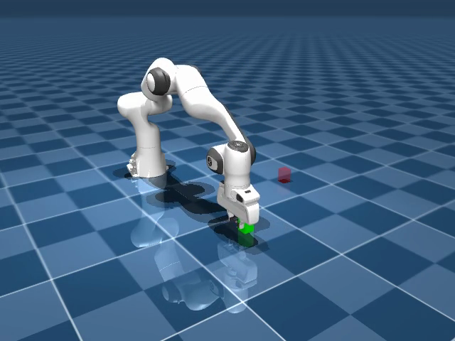

# Spotter

**Frozen robot policy does pick-and-place in MuJoCo; Gemma 4 31B on Cerebras watches for failures and issues corrective instructions in a live loop.**



Hackathon project -- Cerebras x Google DeepMind Gemma 4 Hackathon, 2026. Solo, 24h.

---

## What it does

A Franka Panda arm runs a pick-and-place task in MuJoCo simulation. The robot fails routinely: the gripper closes on empty air, the cube drifts out of reach, or the arm stalls. Without supervision, the failure is silent. With Spotter, a 3-agent Gemma 4 pipeline on Cerebras watches camera frames and cheap ground-truth signals from the sim, diagnoses the failure in natural language, and rewrites the instruction. The corrected instruction is fed back into the actor. The loop runs at ~1 Hz; a full 3-agent call takes 2--4 seconds.

The key claim is narrow: Cerebras inference speed makes this a **live correction loop** rather than a post-mortem. The supervisor fires while the episode is still running, not after it has already failed past recovery.

This is an exploration of the FPC-VLA pattern (semantic supervision of a frozen policy), not a novel architecture. See Prior Work below.

---

## Architecture

```
Camera frame + sim signals
        |
        v
  [ Perception agent ]   -- describes what is visible; outputs structured scene state
        |
        v
  [ Planner agent ]      -- diagnoses failure; rewrites instruction
        |
        v
  [ Validator agent ]    -- checks the rewritten instruction is safe and executable
        |
        v
  Corrected instruction --> Actor (classical IK/PD or Pi0 VLA)
```

All three agents are Gemma 4 31B on Cerebras (`gemma-4-31b`, OpenAI-compatible Chat Completions). The supervisor loop runs at ~1 Hz. Rate-limit budget: 100 RPM, kept by batching the 3 calls per cycle and running the demo loop at 1 Hz.

### Actors

- **Classical** -- IK/PD controller, fully deterministic, no ML inference. This is the guaranteed floor. The supervisor issues corrected waypoints when it detects failure.
- **Pi0 VLA** -- frozen lerobot Pi0 policy. The supervisor rewrites the language instruction fed to the policy rather than overriding waypoints directly (the "coach" pattern from FPC-VLA). Optional dependency; falls back to classical if unavailable.

### Failure signals

Failure detection uses cheap sim ground-truth, not pixel-based inference. Gemma does **semantic interpretation** of these signals, not raw pixel failure detection.

| Signal | Condition |
|--------|-----------|
| `gripper_missed` | Gripper is commanded closed but cube contact force is below threshold |
| `cube_out_of_region` | Cube center is outside the reachable workspace box |
| `no_progress_timeout` | End-effector displacement < 1 cm over N steps while task is incomplete |
| `pose_mismatch` | Joint configuration diverges from expected trajectory by > threshold |

---

## Demo trace (episode 008, real Gemma output)

Supervised run. The cube was nudged 8 cm off the nominal grasp position at the start.

```
step 1000  gripper_missed
  diagnosis:  "The gripper is closed but is not holding the cube."
  correction: "Open the gripper, move the arm forward by 5cm to center the gripper
               over the green cube, descend to grasp height, and re-grasp."
  latency: 3.87s

step 2000  gripper_missed
  diagnosis:  "The gripper is closed but is not holding the cube, which remains
               on the table."
  correction: "Open the gripper, move the arm forward to center the gripper over
               the green cube, and perform a re-grasp."
  latency: 3.64s

step 3000  gripper_missed
  correction: similar -- re-grasp with updated arm position
  latency: 6.57s
```

Demo videos are local MP4s (not hosted). Clone the repo and run `make pull` to fetch them:

- `outputs/episodes/008_supervised.mp4` -- supervised run, Gemma fires corrections
- `outputs/episodes/008_unsupervised.mp4` -- unsupervised run, robot fails silently

---

## Repo layout

```
simulator/    mujoco scene, control loop, render helpers
actor/        classical IK/PD controller + Pi0 VLA wrapper
supervisor/   Cerebras client, 3-agent pipeline, failure signal detectors
prompts/      system prompts for Perception, Planner, Validator agents
scripts/      run helpers, demo scripts
tasks/        pick-and-place task definition
outputs/      episode recordings (mp4s, not checked in)
```

---

## How to run

Tested on DGX Spark (ARM64, headless). Requires `MUJOCO_GL=egl` for headless render.

### Requirements

- Python 3.11+
- `mujoco`
- `cerebras-cloud-sdk`
- `robot_descriptions`
- `lerobot` (optional -- only needed for Pi0 actor)

### Quick start

```bash
# sync code to the DGX Spark
make push

# smoke test: loads scene, renders one frame, exits
make smoke

# classical actor demo -- cube is nudged 8cm, supervisor fires corrections
MUJOCO_GL=egl python scripts/run_classical_demo.py --nudge 0.08

# Pi0 VLA + Gemma supervisor
MUJOCO_GL=egl python scripts/test_vla_supervised.py
```

Set `CEREBRAS_API_KEY` in your environment before running the supervisor.

### Without Cerebras (classical floor only)

```bash
MUJOCO_GL=egl python scripts/run_classical_demo.py --no-supervisor
```

The classical IK/PD controller does pick-and-place without any LLM call. This is the guaranteed-working floor of the system.

---

## Prior work

This project explores the supervision pattern from FPC-VLA and related work. We make no novelty claim. Cited lineage:

- **FPC-VLA** (arXiv 2509.04018) -- frozen policy + semantic corrective supervisor, the direct antecedent
- **RoboFAC** (2505.12224) -- failure-aware correction for robot manipulation
- **CycleVLA** (2601.02295) -- cyclical VLA supervision
- **SayCan** (Ahn et al., 2022) -- LLM as task planner grounded by affordances
- **Inner Monologue** (Huang et al., 2022) -- language feedback in closed-loop robot control
- **Code as Policies** (Liang et al., 2023) -- LLM-generated code for robot policy

---

## Honest limitations

- The supervisor issues corrective **instructions**, not raw waypoints, when the Pi0 actor is in the loop. With the classical actor, it issues waypoints -- labeled as the fallback, not the intended design.
- Latency numbers (2--4s) include only Cerebras token generation and the 3-agent serial call. Network round-trip to the DGX Spark is not included and is not improved by Cerebras.
- The "fast vs slow" comparison is not yet implemented (Rung 5 of the build ladder). Current demos use Cerebras only.
- Recovery in the demo relies on the cube staying on the table after a missed grasp. More severe failure modes (cube knocked off the table) are not handled.
